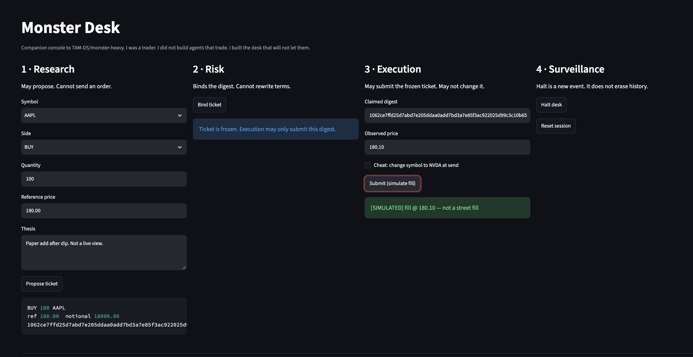
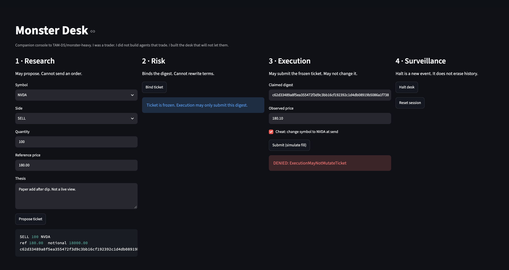
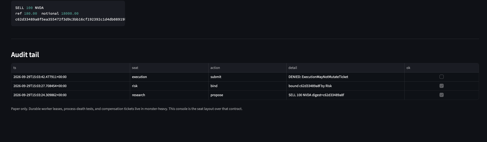

# Monster Desk

Companion console to [TAM-DS/monster-heavy](https://github.com/TAM-DS/monster-heavy).

> I was a trader. I did not build agents that trade. I built the desk that will not let them.

Monster Heavy is the durable engine: frozen proposal terms, human approval, current-policy check, PostgreSQL lease, worker death, compensation as a new ticket.

Monster Heavy has **no frontend** on purpose. This repo is only the four seats.

| Seat | May | May not |
|---|---|---|
| Research | Propose a ticket | Send an order |
| Risk | Bind the ticket digest | Rewrite symbol, side, or size |
| Execution | Submit the **bound digest** | Mutate the ticket |
| Surveillance | Halt, record | Erase history |

A simulated fill is not a street fill. Paper only.

## See the seats

These are screenshots of the running console, not mockups.

**01 · Bound ticket + simulated fill** — Risk froze the digest. Execution submitted that digest only. The banner says it is not a street fill.



**02 · Execution denied** — Cheat attempts to change the name at send. Desk returns `DENIED: ExecutionMayNotMutateTicket`.



**03 · Audit tail** — propose and bind succeeded. The mutated submit stayed `ok = false`. History was not erased.



## The demo (90 seconds)

1. Research proposes `BUY 100 AAPL`.
2. Execution **Submit** before Risk binds → `DENIED: TicketNotBound`.
3. Risk binds.
4. Execution checks **Cheat: change symbol to NVDA** → `DENIED: ExecutionMayNotMutateTicket`.
5. Execution submits the bound digest → `[SIMULATED] fill` + audit row.

Durable leases and double-execution tests stay in Monster Heavy. Do not claim this console replaced them.

## Run

```bash
python3 -m venv .venv
source .venv/bin/activate
pip install -r requirements.txt
python -m pytest tests/ -q
streamlit run app.py
```

## Interview line

Monster Heavy proves the boundary survives a dead worker.  
Monster Desk shows the seats so a hiring manager can see who is not allowed to trade.
